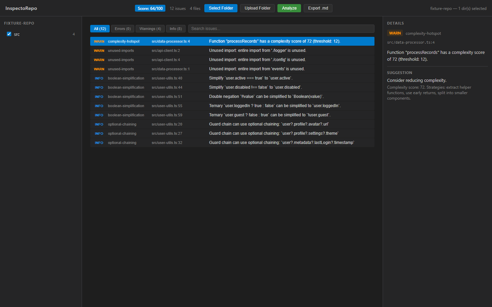

# InspectoRepo

A local web application that analyzes TypeScript + React codebases and produces structured code review suggestions with a VSCode-like interface.

## Why

Manual code review is time-consuming and inconsistent. InspectoRepo provides deterministic, AST-based analysis of TS/TSX files — surfacing real improvement opportunities with proposed diffs, all running locally with zero dependencies on paid APIs.

## Key Features (V1)

- **Folder selection** — pick a local codebase using File System Access API (Chrome/Edge) with a fallback `<input webkitdirectory>` upload
- **Directory tree** — browse top-level directories with checkboxes; defaults to `src/` if present
- **TS/TSX analysis engine** — deterministic pipeline: scan → parse (ts-morph in-memory) → apply rules → score → report
- **Issue list UI** — filterable by severity/search, with detail panel showing suggestions and proposed patches
- **Scoring** — 0–100 score based on issue severity counts
- **Markdown export** — download a full analysis report as `.md`
- **Exclude rules** — automatically skips `node_modules`, `dist`, `build`, `.git`, hidden dirs, and other noise
- **Monorepo architecture** — npm workspaces with `shared`, `core`, and `web` packages
- **CI pipeline** — GitHub Actions running lint, typecheck, build, and test on every push/PR

## Implemented Rules

| Rule | Severity | Description |
|------|----------|-------------|
| `unused-imports` | warn | Detects unused import specifiers (default, namespace, named) and suggests removal with a safe proposed patch |
| `complexity-hotspot` | warn | Flags functions with high cyclomatic-like complexity (≥ 12) and suggests refactoring strategies |
| `optional-chaining` | info | Detects monotonic guard chains like `a && a.b && a.b.c` and suggests optional chaining (`a?.b?.c`) |
| `boolean-simplification` | info | Simplifies `x === true`, `x === false`, `!!x`, and `x ? true : false` patterns |

## Planned Rules (Roadmap)

| Rule | Severity | Description |
|------|----------|-------------|
| `early-return` | info | Suggest guard clauses to reduce nesting |

## Tech Stack

| Layer    | Technology                |
| -------- | ------------------------- |
| Frontend | React 18 + TypeScript     |
| Bundler  | Vite                      |
| Analysis | ts-morph (TypeScript AST) |
| Testing  | Vitest                    |
| Monorepo | npm workspaces            |

## Project Structure

```
inspectorepo/
├── apps/
│   └── web/              # React frontend (Vite)
├── packages/
│   ├── cli/              # Headless CLI for terminal-based analysis
│   ├── core/             # Analysis engine (ts-morph, rules, scoring, report)
│   └── shared/           # Shared types (Issue, AnalysisReport, VirtualFile)
├── examples/
│   ├── fixture-repo/     # Sample TS files for testing all rules
│   └── sample-report.md  # Generated analysis report
├── screenshots/          # UI screenshots & Playwright automation
├── ai/                   # AI agent instructions, project context & repomix exports
├── docs/                 # Architecture, worklog, code walkthrough
└── package.json          # Root workspace config
```

## Getting Started

```bash
# Install dependencies
npm install

# Start dev server
npm run dev

# Run checks
npm run lint
npm run typecheck
npm run build
npm test
```

## Scripts

| Script                | Description                  |
| --------------------- | ---------------------------- |
| `npm run dev`         | Start Vite dev server        |
| `npm run build`       | Build all packages + web app |
| `npm run lint`        | Lint all TS/TSX files        |
| `npm run typecheck`   | TypeScript type checking     |
| `npm run format`      | Format with Prettier         |
| `npm run format:check`| Check formatting             |
| `npm test`            | Run Vitest tests             |
| `npm run repopack`   | Generate repomix exports     |

## Demo

Try InspectoRepo locally in three steps:

1. **Clone the repository**
   ```bash
   git clone https://github.com/wai-coding/inspectorepo.git
   cd inspectorepo
   ```

2. **Install dependencies**
   ```bash
   npm install
   ```

3. **Run the development server and analyze a folder**
   ```bash
   npm run dev
   ```
   Open the URL shown in the terminal. Click **Select Folder** (Chrome/Edge) or **Upload Folder** (any browser) to load a TypeScript project. Use the sidebar checkboxes to pick directories, then click **Analyze**. View issues in the main panel, click any issue to see details and proposed fixes, and click **Export .md** to download a Markdown report.

   > **Browser support:** The folder picker uses the File System Access API (Chrome/Edge). Other browsers can use the Upload Folder fallback.

## CLI

Analyze any TypeScript project from the terminal:

```bash
# Basic analysis (markdown report to stdout)
inspectorepo analyze ./my-project

# Analyze specific directories with markdown output
inspectorepo analyze ./my-project --dirs src --format md

# JSON output
inspectorepo analyze ./my-project --format json

# Write report to file
npx inspectorepo analyze ./my-project --out report.md

# Limit issues and select specific directories
npx inspectorepo analyze ./my-project --dirs src,lib --max-issues 10
```

### Auto-Fix

Apply safe code fixes interactively:

```bash
inspectorepo fix ./my-project
```

The fix command runs analysis, finds issues with safe auto-fix suggestions, shows a preview of each proposed change, and asks for confirmation before applying. Only `optional-chaining`, `boolean-simplification`, and `unused-imports` rules support auto-fix. `complexity-hotspot` is never auto-applied.

Example output:

```
optional-chaining suggestion
File: src/user.ts:12
Suggested diff:

  - user && user.profile && user.profile.name
  + user?.profile?.name

Apply fix? (y/N)
```

The CLI uses the same analysis engine as the web UI. Output is deterministic — same input always produces the same report.

## Interface Preview



> Dark VSCode-like interface with file tree sidebar, issues list in the main panel, and detail/diff view on the right.

## Sample Output

See [examples/sample-report.md](./examples/sample-report.md) for a full analysis report generated from the [fixture repo](./examples/fixture-repo/). This shows the exact Markdown output InspectoRepo produces, including severity emojis, issue tables, and collapsible proposed diffs.

## Roadmap

### V1 (current)

- [x] Monorepo setup with npm workspaces
- [x] Core analysis engine skeleton
- [x] VSCode-like UI layout
- [x] File System Access API integration + fallback upload
- [x] Directory tree with selection
- [x] Real analysis pipeline (scan → parse → rules → score → report)
- [x] Rule: `unused-imports` — detect and suggest removal of unused imports
- [x] Rule: `complexity-hotspot` — flag high-complexity functions with refactor suggestions
- [x] Rule: `optional-chaining` — suggest `?.` for guard chains
- [x] Rule: `boolean-simplification` — simplify redundant boolean expressions
- [ ] Rule: `early-return` — suggest guard clauses to reduce nesting (spec defined, stub in place)
- [x] Issue list with severity filters + search
- [x] Detail panel with proposed patches + copy
- [x] Markdown report export
- [x] Scoring (0–100)

### V2 (planned)

- [x] Auto-apply suggested fixes (`inspectorepo fix`)
- [x] CLI package for headless analysis
- [ ] Custom rule authoring
- [ ] VS Code extension

## Screenshots

Screenshot and demo video are generated automatically with Playwright:

```bash
# Start dev server first
npm run dev

# Capture screenshot
npx tsx screenshots/capture.ts

# Record demo video
npx tsx screenshots/record-demo.ts
```

## License

MIT
